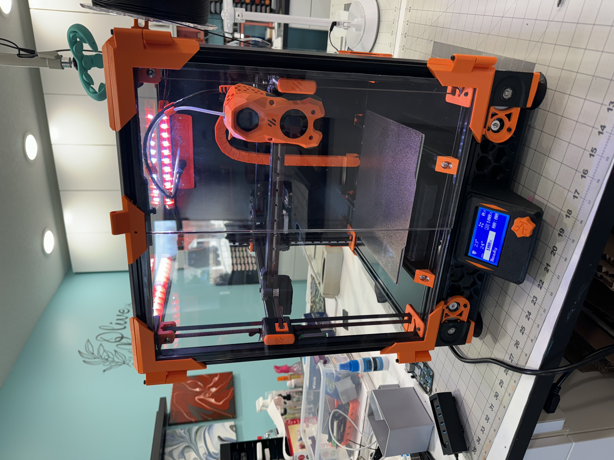

# EndeVOR 2.4

This project is to build a Voron 2.4 from Parts from an Ender-3.  I chose this project because a lot of people have an Ender sitting in the corner that was their first printer, and they feel bad about just letting it go to e-waste.  I was able to build this project using a bunch of spare parts that I had on hand which lowered my cost significantly. I estimate this would cost roughly 300 to 400 U.S. dollars to convert it yourself. The majority of the cost is in the frame and the panels. I've included a CSV of my bill of materials in case that's helpful.

In doing this project I had a number of design goals:  
1.	Make this as close to a stock Voron 2.4 as possible. 
2.	Reuse as many ender parts as possible including the screen, the electronics, the wiring, the motors, and whatever else I could repurpose.  
3.	Print as many pieces as possible in order to reserve cost. This meant using low cost cameras, printed Z chains, and utilizing my zero panels mod to save on hardware. 
4.	There are a few quality of life improvements including sensorless homing, can bus tool head, Nevermore filter, full panels, and lighting.  

Links to Mods  
    I am linking to my printables page.  Please download from there, I like free filament! 
1. [Ender Screen Mod](https://www.printables.com/model/794697-ender-3-screen-mount-for-voron-24-and-trident-ende)
2. [Zeropanels 2020 Edition](https://www.printables.com/model/803352-zeropanels-2020-edition)  note: I used screws instead of magnets
3. [Z belt cable cover](https://www.printables.com/model/832359-z-belt-cable-cover-mk2)
4. [Collection of other people's mods](https://www.printables.com/@OneHotTake_1106894/collections/1274945)
5. [Panzer Chain](https://mods.vorondesign.com/details/AVX0p7l2NUIQANECCD9Og)
6. [Rama Idlers](https://github.com/Ramalama2/Voron-2-Mods)

## Vids  

First Print https://www.youtube.com/shorts/qwX8Vk2GfZ4 

## Pics
Assembled:  

